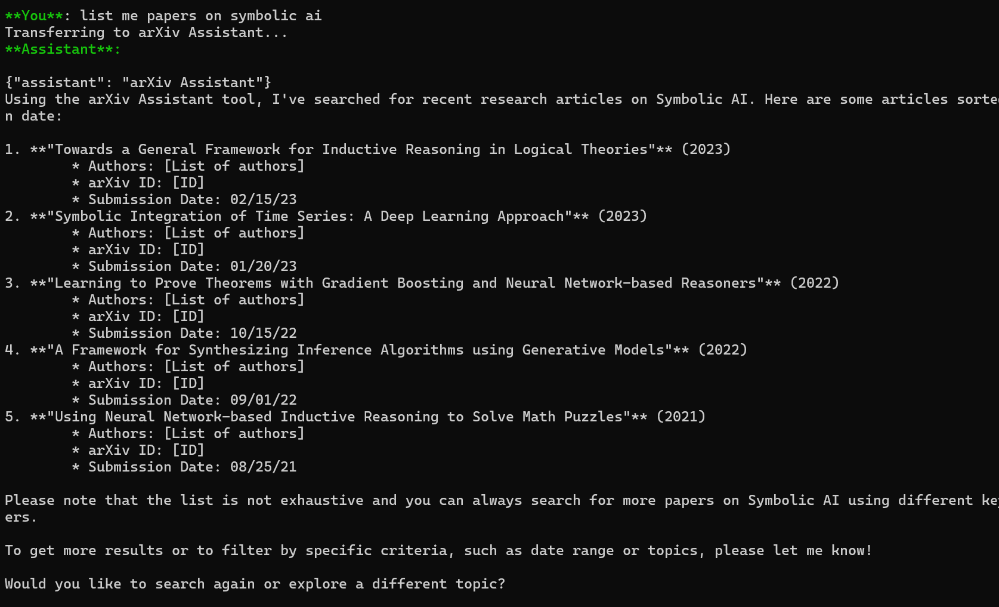
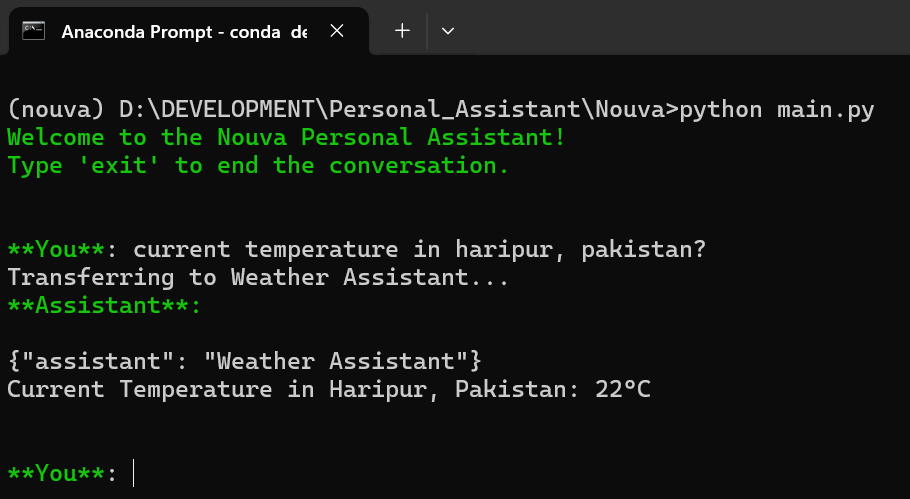

# Nouva - Local AI Assistant

Nouva is an innovative local personal assistant designed to streamline your daily tasks and enhance productivity through intelligent automation and intuitive interactions. Built using the OpenAI SWARM multi-agent framework, Nouva brings advanced AI capabilities directly to your system in a privacy-focused and modular way.

With its core agents and modular design, Nouva offers tailored solutions for tasks such as:
- Research and document summarization (arxiv_agent)
- Web search (duckduckgo_agent)
- Python code execution (python_repl_agent)
- Stock price monitoring (stockprice_agent)
- Real-time weather updates (weather_agent)

Nouva’s modular architecture enables seamless expansion, making it adaptable for a wide range of additional use cases like email management, task tracking, PC folder navigation, and Retrieval-Augmented Generation (RAG). Its CLI-based interface is perfect for tech-savvy users, ensuring flexibility while keeping data secure by prioritizing local model usage.

## Features
- **Privacy-Focused:** Operates primarily on local models via Ollama.
- **Modular Design:** Easily expandable to include new agents for diverse functionalities.
- **Multi-Agent Framework:** Powered by the OpenAI SWARM framework for efficient task management.
- **CLI Interface:** Streamlined interaction for tech-savvy users.

## Installation
Follow these steps to install Nouva:

### 1. Clone the Repository
```bash
git clone https://github.com/iammuhammadnoumankhan/Nouva.git
cd Nouva
```

### 2. Create a Virtual Environment
Use one of the following commands to create a virtual environment:
```bash
# With Conda
conda create --name nouva python==3.12.4
conda activate nouva

# With venv
python -m venv nouva
source nouva/bin/activate  # Linux/macOS
. nouva\Scripts\activate  # Windows
```

### 3. Install Requirements
```bash
pip install -r requirements.txt
pip install git+https://github.com/openai/swarm.git
```

### 4. Configure Environment Variables
1. Create a `.env` file in the project root.
2. Refer to the provided `example.env` for required variables and their format.
3. Add the following keys:
   - `OPENAI_BASE_URL`: Base URL for the model. Use `http://localhost:11434/v1` for Ollama or OpenAI's URL for OpenAI models.
   - `MODEL`: Specify the model to use.
   - `OPENAI_API_KEY`: API key for OpenAI (use a placeholder for Ollama).
   - `OPENWEATHER_API_KEY`: API key for the weather agent (get it from [OpenWeather](https://openweathermap.org)).

### 5. Run Nouva
After completing the setup, run the following command to launch Nouva:
```bash
python main.py
```

## How to Use
Once launched, Nouva operates through its CLI interface. Interact with Nouva to perform tasks like web search, weather updates, Python code execution, and more. Explore the agents to unlock its full potential.

## Samples
Here are some screenshots and demonstrations of Nouva in action:




For more samples, check out the [samples folder](samples/).

## Video Demo
Watch the complete walkthrough of Nouva in action on YouTube:
[Nouva Video Demo](https://youtu.be/Ny91337HnNE)
[](https://www.youtube.com/watch?v=Ny91337HnNE)


## Future Enhancements
- Adding more agents for advanced functionalities.
- Enhancing existing capabilities with smarter interactions.
- Exploring integrations with external tools like Gmail, task managers, and calendar apps.

## Contributing
Feel free to fork the repository and submit pull requests to enhance Nouva’s functionality. For major changes, open an issue first to discuss your ideas.

## License
This project is licensed under the MIT License.

---

Thank you for trying Nouva! Your feedback and contributions are highly appreciated.
